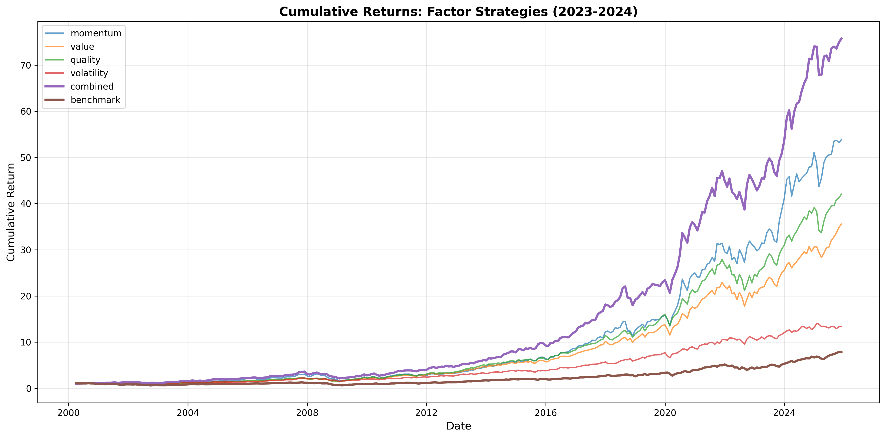
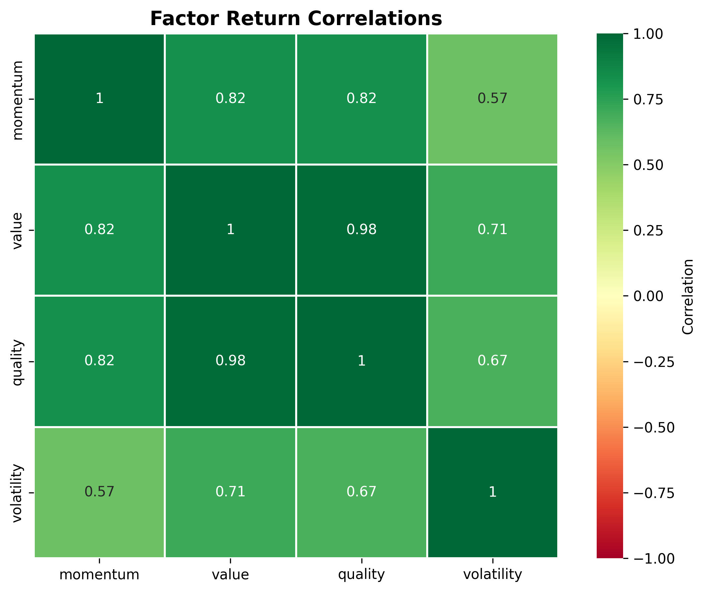
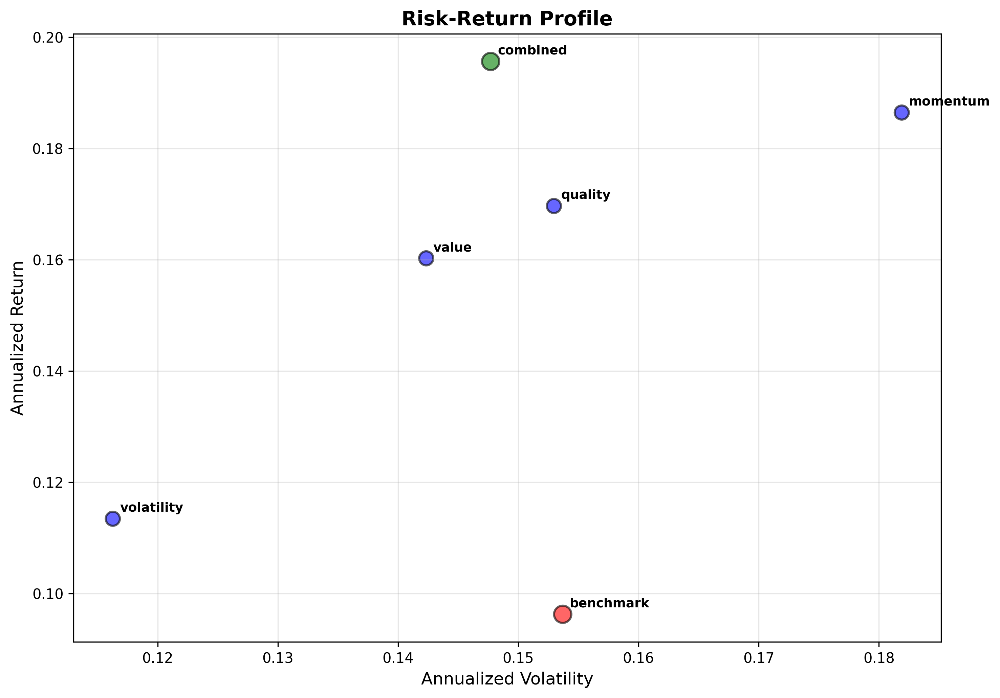

# Factor Investing Backtest
Backtesting framework for systematic factor strategies (momentum, value, quality, volatility) on S&P 500 stocks.

## Introduction
This personal learning project implements a systematic multi-factor investing strategy to explore how momentum, value, quality, and volatility factors combine to improve risk-adjusted returns. I use Yahoo Finance data from 2000-2025 to construct long portfolios based on these factor signals and compare their performance to the S&P 500 benchmark.

## Design & Implementation
### Factors
I wanted to explore some fundamental factors used today: momentum, value, quality, and volatility.

The measure of value has long shifted from HML to B/P. Book-to-Price (B/P) is one of the data categories from Yahoo Finance that introduces a good deal of lookahead bias with a restated book value. As such, I am using earnings yield (E/P) to serve a similar function, although it is not as clean as a better source of fundamental data on B/P. As an attempt to reduce look-ahead bias from E/P, I am using a twelve month trailing (TTM) with a 1-quarter lag (instead of 2 months, because Yahoo Finance uses reporting dates).

Quality has a couple different possible implementations as well. In this case, I will be using gross profitability [^quality] rather than ROE. Gross profitability is also harder to distort than ROE on the books, which can be affected by stock buybacks.

1. **Momentum (12-1 month)**: 12-month price return excluding most recent month to avoid short-term reversals
$$R_{mom} = \frac{P_{t-1}}{P_{t-13}} - 1$$
2. **Value (Earnings-to-Price)**: Trailing 12-month earnings-to-price ratio with 1-quarter lag to reduce look-ahead bias
$$\text{E/P}=\frac{\text{Earnings}}{\text{Market Cap}}$$
3. **Quality (Gross Profitability)**: Gross profit to total assets ratio as profitability measure
$$\text{GP/A}=\frac{\text{Gross Profits}}{\text{Total Assets}}$$
4. **Volatility (Total)**: Rolling standard deviation of returns
$$\sigma_{total} = \sqrt{\frac{1}{N-1}\sum^N_{i=1}(R_i - \bar R)^2}$$

### Portfolio Construction
- **Universe**: 100 S&P 500 stocks (2000-2025)
- **Rebalancing**: Monthly
- **Selection**: Long-only top 20% quintile
- **Weighting**: Equal-weighted within portfolio
- **Normalization**: Z-score standardization of factor signals

### Limitations & Considerations
1. Look-ahead bias: Yahoo Finance uses as-reported data instead of point-in time.
2. Survivorship bias: using only current S&P 500 stocks (excludes delisted).
3. Limited history: Yahoo Finance contains data on reporting dates vs actual dates, restatements, and availability depends on the stock.
4. Small universe: using 100 stocks as opposed to 3000+, inflates factor correlation (quite high in this analysis)
5. Transaction costs: unrealistic given monthly rebalancing and annual turnover for S&P 500
6. Total volatility proxy: switched from idiosyncratic volatility for speed

### Portfolio Metrics
For this analysis, I am using annual returns, annual volatility, Sharpe ratio, win rate, and max drawdown. These are standard metrics and a couple behavior metrics, meant to capture facets of the investor's psychology. I gather that professionals use a range of different risk metrics in combination, but I've chosen just to implement two for the exercise: maximum drawdown and win rate.

The reason I chose these two is because of following scenario. Suppose we have two stocks which start and end a period at the same values. One of them crashes near the beginning and one of them crashes at the end. Maximum drawdown will treat these the same as long as they have the same peak and trough over the same period of time. Maximum drawdown is limited and doesn't capture the duration or pattern of the changes or the corresponding investor psychology around timing.

Win rate, however, does capture some of this psychology around timing, as it roughly reflects the proportion of time an investor feels positively or negatively about a stock. As such, I thought it would be interesting to add this into the analysis.

The risk-free rate has changed throughout history for various periods of time, and is still changing recently. I've implemented a 2% risk-free rate for the Sharpe and Sortino ratios. Given more time, I would use the 3-month T-bill rates around the same time period as the metric.

## Results

### Performance Summary

| Strategy | Sharpe | Ann. Return | Ann. Vol | Max DD | Win Rate |
|----------|--------|-------------|----------|--------|----------|
| Momentum | 0.92 | 18.2% | 18.2% | -47.9% | 63.4% |
| Value | 0.99 | 16.0% | 14.2% | -35.5% | 67.6% |
| Quality | 0.98 | 17.0% | 15.3% | -38.4% | 66.7% |
| Volatility | 0.80 | 11.3% | 11.6% | -32.5% | 63.8% |
| **Combined** | **1.19** | **19.6%** | **14.8%** | **-41.1%** | **67.3%** |
| S&P 500 | 0.50 | 9.6% | 15.4% | -50.8% | 61.8% |

### Cumulative Returns

### Factor Correlation

### Risk-Return Profile

## Interpretation
**Factor Diversification Works:**
Despite high portfolio return correlations (0.57-0.98), the combined portfolio achieves superior risk-adjusted returns (Sharpe 1.19 vs. 0.50). This demonstrates that even with a small universe, factors capture different return drivers.

**Factor Signal Independence:**
The high *portfolio return* correlations stem from:
- Small universe (100 stocks → only 10 holdings per portfolio → high overlap)
- Large-cap bias (mega-cap tech dominates multiple factors)

Momentum had the highest return and volatility, reflecting trending stocks. Value and quality both were more moderate, with lower volatility and lower returns than momentum. Comparatively, volatility had the lowest return and risk. This confirms again that the risk factors heavily into returns.

The combined portfolio's max drawdown (-41.1%) is better than benchmark's (-50.8%), despite including momentum (which had -47.9% drawdown). This is a demonstration of the benefits of rebalancing and diversification.

Academic factor study results ranges (handwavey):
- Single factor Sharpe ratios: 0.3-0.7
- Combined factor Sharpe ratios: 0.8-1.2
- Portfolio return correlations: 0.2-0.5

This implementation shows:
- Single factor Sharpe ratios: 0.80-0.99 (high due to look-ahead bias)
- Combined Sharpe: 1.19 (within range)
- Portfolio correlations: 0.57-0.98 (high due to small universe)

The elevated correlations are expected given the 100-stock universe vs. 1000+ stocks in studies.

## Ideas for Future Enhancement
- Expand universe of stocks
- Test in different markets (international, bull vs bear, etc)
- Incorporate transaction costs
- Add ML for factor timing and news sentiment
- Use 3-month T-bill rates for accurate risk-free rate
- Use correct number of trading days (variable by year)

## Setup Instructions
1. Create virtual environment: `python3 -m venv venv`
2. Activate virtual environment: `source venv/bin/activate`
3. Install dependencies: `pip install -r requirements.txt`

## Reference
[^asness]: General idea is from Asness's ["Value and Momentum Everywhere" (2013)](https://papers.ssrn.com/sol3/papers.cfm?abstract_id=2174501).

[^quality]: Novy-Marx's ["The Other Side of Value" (2013)](https://mysimon.rochester.edu/novy-marx/research/OSoV.pdf) suggests that gross profitability is a similarly effective premium to book/price ratio.